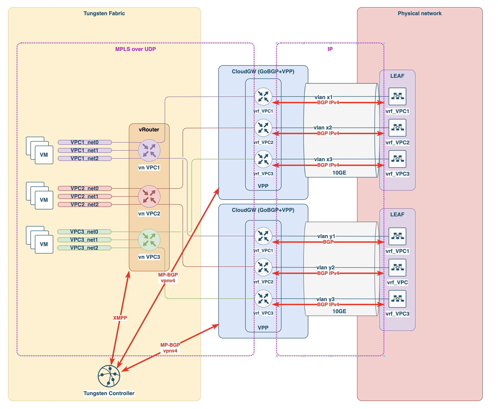

= Cloudgw connection scheme

Cloudgw uses at least 2 interfaces for communication with Tungsten Fabric vRouters and physical networks.

- one interface for Data plane
- one interface for Control plane

Data plane interface is used for communication with vRouters and physical router (main interface for MPLS over UDP tunnels, and sub-interfaces for external routers).
Data plane interface used by VPP (DPDK) and not available on Linux after VPP start.

Control plane interface is used for communication with Tungsten Fabric controllers by BGP (main interface) and communication with external routers (sub-interfaces).
It is native Linux interface and available on Linux as well.

Cloudgw concept scheme:

Typical cloudgw connection scheme:

image::../img/cloudgw_phy_connect.png[Cloudgw Physical Connection Scheme]

NOTE: VLAN ID for data plane and control plane interfaces are the same.

NOTE: Cloudgw IP addresses for data plane and control plane interfaces are different.
