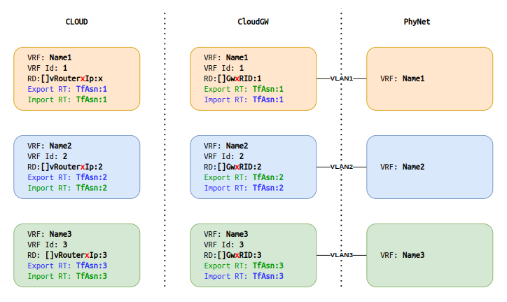
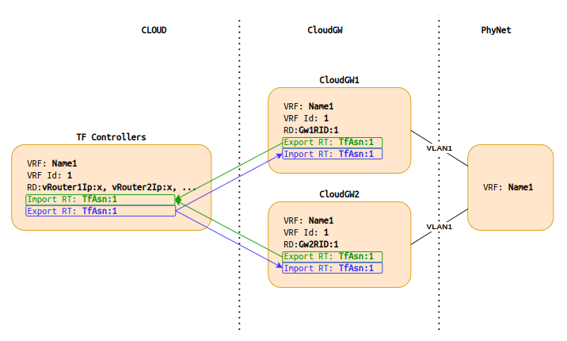

= Overlay setting

To simplify the configuration of the overlay, the following table is used in cloudgw to communicate with Tungsten Fabric and vRouters.

== Overlay parameter table

[%header,cols="1,1,1",options="header"]
|===
| Parameter
| Tungsten Fabric
| CloudGW

| VRF ID
| Assigned automatically by each vRouter
| Assigned *manually* for each VRF as YAML parameter (1, 2, 3, ...)

| MPLS Label
| Assigned automatically by vRouter for each VM regardless of the VRF
| Assigned statically for each VRF (the same label for all subnets of a VRF): 1000000 + string(VPP VRF Local IP)[-4:]

| RD
| Assigned automatically by vRouter: <vRouter IP> : <vRouter VRF ID>
| Assigned by CloudGW for each VRF: <CloudGW RouterID> : <CloudGW VRF ID>

| Export RT
| Assigned *manually* in TF for each Virtual Network: <TF ASN> : <CloudGW VRF ID>
| Assigned statically by CloudGW for each VRF: <TF ASN> : <CloudGW VRF ID>

| Import RT
| Assigned *manually* in TF for each Virtual Network: <TF ASN> : <CloudGW VRF ID>
| Assigned statically by CloudGW for each VRF: <TF ASN> : <CloudGW VRF ID>
|===

=== Overlay Concept

=== Overlay Example

