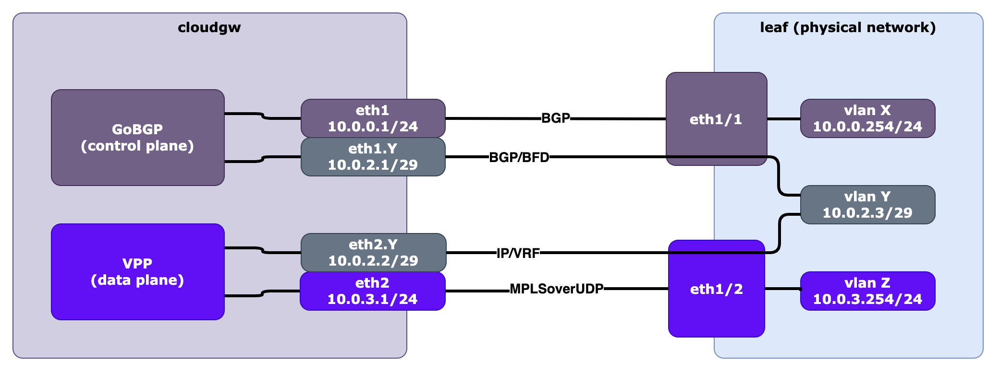

= Схема подключения Cloudgw

Cloudgw использует как минимум два интерфейса для связи с виртуальными маршрутизаторами (vRouter) Tungsten Fabric и внешними маршрутизаторами.

- один интерфейс для плоскости данных
- один интерфейс для плоскости управления

Интерфейс плоскости данных используется для связи с vRouter'ами Tungsten Fabric (основной интерфейс для туннелей MPLS over UDP и sub-интерфейсы для физических сетей).
Интерфейс плоскости данных используется VPP (DPDK) и недоступен в Linux после запуска VPP.

Интерфейс плоскости управления используется для связи с контроллерами Tungsten Fabric по BGP (основной интерфейс) и связи с физическими сетями (sub-интерфейсы).
Представляет собой нативный интерфейс Linux.

Концептуальная схема Cloudgw:

image::../img/cloudgw_concept.png[Концептуальная схема Cloudgw]

Типовая схема подключения CloudGW:

ПРИМЕЧАНИЕ. Идентификатор VLAN для интерфейсов плоскости данных и плоскости управления одинаковый.

ПРИМЕЧАНИЕ. При подключении к внешним маршрутизаторам IP-адреса Cloudgw для интерфейсов плоскости данных и плоскости управления различаются.
